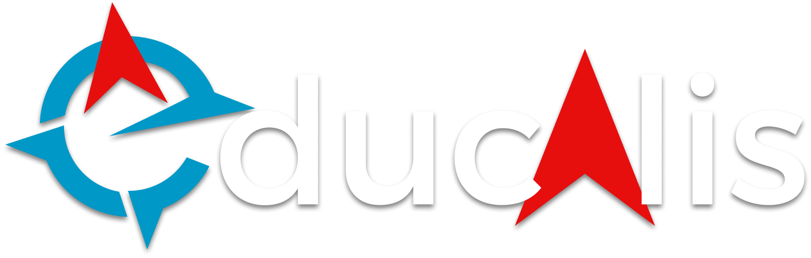

<h2 align="center"> 

Expandindo as fronteiras da educação
</h2>

<p align="center">
  
  
</p>


<p align="center">
  <a href="#rotating_light-Problema">Problema</a>&nbsp;&nbsp;&nbsp;|&nbsp;&nbsp;&nbsp;
  <a href="#bulb-Solução">Solução</a>&nbsp;&nbsp;&nbsp;|&nbsp;&nbsp;&nbsp;
  <a href="#construction-Requerimentos-para-plataforma">Requerimentos para plataforma</a>&nbsp;&nbsp;&nbsp;|&nbsp;&nbsp;&nbsp;
  <a href="#rocket-Tecnologias-usadas">Tecnologias usadas</a>&nbsp;&nbsp;&nbsp;|&nbsp;&nbsp;&nbsp;
  <a href="#arrow_forward-Rodando-a-aplicação">Rodando a aplicação</a>&nbsp;&nbsp;&nbsp;|&nbsp;&nbsp;&nbsp;
  <a href="#heart-Nosso-time-dos-sonhos">Nosso time dos sonhos</a>
</p>

## :rotating_light: Problema

No Brasil, cerca de 6 milhões de crianças e adolescentes, de 9 a 17 anos, não têm acesso à internet em casa. Cerca de 17% de todos os brasileiros nessa faixa etária.

Uma realidade difícil de entender quando pensamos no mundo extremamente conectado de hoje, onde a internet é capaz de abrir muitas portas.

Com a internet, os jovens podem se aprofundar nos estudos e se preparar melhor para as oportunidades de trabalho, pois quanto maior o nível de escolaridade, maiores as chances de conseguir um emprego.

<i>Fonte: EBC - Empresa Brasil Comunicação / IBGE</i>

## :bulb: Solução

Utilizando um conjunto de dispositivos movidos a energia solar (E-hubs), conectados sem fio entre si, é criada uma rede, que pode ser acessada por qualquer pessoa com um smartphone 
ou computador. 

Utilizar o Educalis é extremamente simples, basta que o estudante acesse a rede Wi-Fi gerada pelo E-hub mais próximo. Ao conectar-se, o estudante tem acesso a nossa plataforma de ensino virtual, contendo materiais didáticos para todas as idades. 

Para mais informações acesse a Wiki desse repositório ou [clique aqui!](https://github.com/davicoscarelli/educalis/wiki/Mesh-Web-Server)


## :construction: Requerimentos para plataforma 
 
- [Git](https://git-scm.com/)
- [NodeJS](https://nodejs.org/en/)
- [NPM](https://www.npmjs.com/)

## :rocket: Tecnologias usadas

-  [Typescript](https://www.typescriptlang.org/)
-  [Angular](https://angular.io/)
-  [ESLint](https://eslint.org/)
-  [Prettier](https://prettier.io/)
-  [Bootstrap](https://getbootstrap.com/)
-  [FontAwesome](https://fontawesome.com/)

## :arrow_forward: Rodando a aplicação

Esse projeto foi gerado com [Angular CLI](https://github.com/angular/angular-cli) na versão 9.1.7.

### No terminal 

```sh
# Clone o projeto
git clone https://github.com/davicoscarelli/educalis.git

# Vá para a pasta do projeto
cd educalis

# Instale as dependências
npm install

```

## Servidor de desenvolvimento

Digite `ng serve` no terminal para executar a aplicação em modo de desenvolvimento. Abra em seu navegador: `http://localhost:4200/`. A aplicação irá automaticamente recarregar se houver alguma alteração em qualquer arquivo do projeto.

## Gerar códigos

Digite `ng generate component component-name` no terminal para gerar um novo componente. Você também pode utilizar `ng generate directive|pipe|service|class|guard|interface|enum|module`.

## Build

Digite `ng build` no terminal para compilar o projeto. Os arquivos compilados serão armazenados no diretório `dist/`. Use a flag `--prod` para a compilação de produção.

## Executando testes unitários

Digite `ng test` no terminal para executar os testes unitários via [Karma](https://karma-runner.github.io).

## Executando testes end-to-end

Digite `ng e2e` no terminal para executar os testes end-to-end via [Protractor](http://www.protractortest.org/).

## Mais ajuda

To get more help on the Angular CLI use `ng help` or go check out the [Angular CLI README](https://github.com/angular/angular-cli/blob/master/README.md).


## :heart: Nosso time dos sonhos

- [Davi Coscarelli](https://www.linkedin.com/in/davicoscarelli) (Desenvolvedor)
- [Joyce Souza](https://www.linkedin.com/in/joyce-souza-04819523/) (Negócios)
- [Juliana Aintablian](https://www.linkedin.com/in/juliana-aintablian/) (Desenvolvedora)
- [Leonardo Braga](https://www.linkedin.com/in/leonardobbarcelos/) (Educação)
- [Luan Calil](https://www.linkedin.com/in/luancalil/) (UX Designer)
- [Maira Manfro](https://www.linkedin.com/in/maira-gazzi-manfro-a1a7b4192/) (Marketing)
